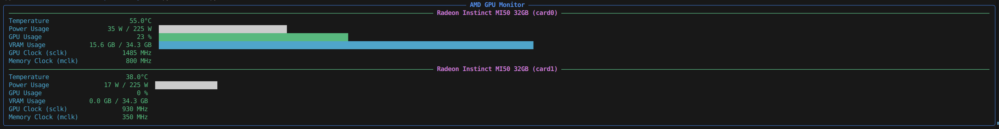

# AMD GPU Status Monitor

A simple, clean, and responsive command-line monitoring tool for AMD GPUs on Linux. It uses `rocm-smi` to fetch real-time data and the `rich` library to display it in a beautiful and readable format in your terminal.

## Screenshot



## Features

-   **Real-time Monitoring**: Continuously updates GPU status for at-a-glance monitoring.
-   **Multi-GPU Support**: Automatically detects and displays statistics for all installed AMD GPUs.
-   **Responsive UI**: The layout dynamically adjusts to your terminal's width.
-   **At-a-Glance Metrics**: Displays the most important GPU statistics:
    -   Temperature
    -   Power Usage (Current / Max)
    -   GPU Core Usage (%)
    -   VRAM Usage (Used GB / Total GB)
    -   GPU and Memory Clock Speeds (sclk/mclk)
-   **Visual Feedback**: Color-coded ASCII bars provide a quick visual representation of usage.
-   **Robust & Compatible**: Designed to be resilient to minor changes in `rocm-smi` output and compatible with various versions of the `rich` library.

## Requirements

Before you begin, ensure you have the following installed on your system:

1.  **Python 3.6+**
2.  **AMD ROCm Stack**: The `rocm-smi` command-line tool must be installed and accessible in your system's PATH. This is the source of all GPU data.
3.  **Rich**: The Python library used for the UI.

## Installation

1.  **Clone the repository (or download the script):**
    ```bash
    git clone https://github.com/BullshiArtist/GPU_Status.git
    cd GPU_Status
    ```
    Alternatively, you can just download the `gpu_status.py` file directly.

2.  **Install the required Python library:**
    ```bash
    pip install rich
    ```

## Usage

To run the monitor, simply execute the Python script from your terminal:

```bash
python gpu_status.py
```

Press `Ctrl+C` to stop the monitor at any time.

## Customization

This script is designed to be easily adaptable. If you are using a different GPU or a version of `rocm-smi` that uses different names for the metrics in its JSON output, you can easily update the script.

Open `gpu_status.py` and modify the `METRIC_KEYS` dictionary at the top of the file. Add the new key from your `rocm-smi` output to the appropriate list. The script will automatically try each key in the list until it finds a match.

**Example:**
If your `rocm-smi` output for temperature was `{"temp_c": 50.0}`, you would update the `TEMP` list like this:

```python
METRIC_KEYS = {
    "TEMP": ["temp_c", "Temperature (Sensor junction) (C)", "Temperature (Sensor edge) (C)"],
    # ... other keys
}
```

## License

This project is licensed under the **Apache License 2.0** - see the [LICENSE](LICENSE) file for details.
